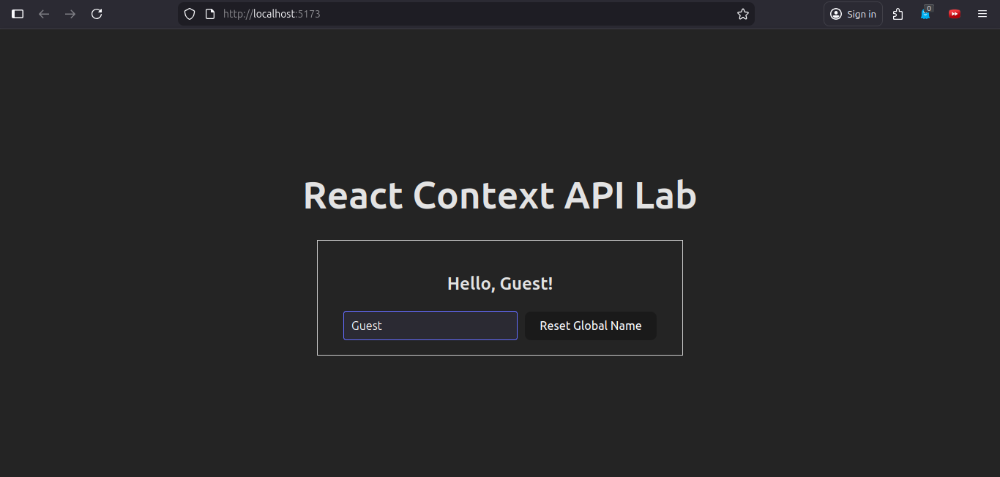
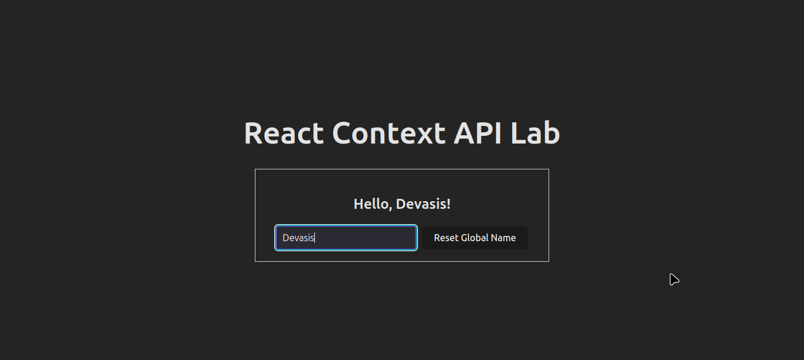
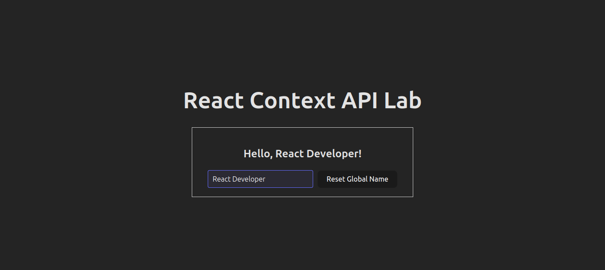

# React Context API Lab

A hands-on learning project demonstrating the React Context API for managing global state without prop drilling.

## Project Overview

This project showcases how to use React's Context API to manage and share state across multiple components. It provides a practical example of creating a global user context where any component can read and update the global state.

## Features

- ✅ Global state management using React Context API
- ✅ Real-time input field that updates global state
- ✅ Button to reset global state
- ✅ Centered, responsive layout
- ✅ Clean and modern UI design

## Project Structure

```
src/
├── App.jsx              # Main application component
├── App.css              # Application styles
├── DisplayComponent.jsx # Component that consumes context
├── UserContext.jsx      # Context creation and provider
├── index.css            # Global styles
└── main.jsx             # Application entry point
```

## Components

### UserContext.jsx
- **Purpose**: Creates and manages the global user state
- **Exports**:
  - `UserContext`: The context object
  - `UserProvider`: Provider component that wraps the app

### DisplayComponent.jsx
- **Purpose**: Consumes the global context and displays the user state
- **Features**:
  - Input field for real-time state updates
  - Button to reset to default state ("React Developer")
  - Displays current user name in heading

### App.jsx
- **Purpose**: Main application component
- **Wraps the app with UserProvider to enable context usage

## Usage

### Setting Up Context

```jsx
import { UserProvider } from './UserContext';

function App() {
  return (
    <UserProvider>
      <DisplayComponent />
    </UserProvider>
  );
}
```

### Consuming Context

```jsx
import { useContext } from 'react';
import { UserContext } from './UserContext';

const DisplayComponent = () => {
  const { user, updateUsername } = useContext(UserContext);
  
  return (
    <>
      <h2>Hello, {user}!</h2>
      <input
        value={user}
        onChange={(e) => updateUsername(e.target.value)}
      />
    </>
  );
};
```

## Screenshots

### Initial State


### User Input in Action


### Reset State


## Key Concepts Demonstrated

1. **Context Creation**: Using `React.createContext()` to create a context object
2. **Provider Pattern**: Creating a provider component to wrap the app
3. **State Management**: Using `useState()` within the provider for global state
4. **Context Consumption**: Using `useContext()` hook to access global state
5. **State Updates**: Passing updater functions through context value

## Styling

- Dark theme with light text
- Centered layout using flexbox
- Responsive input field and buttons
- Smooth transitions and hover effects
- Modern border styling

## Browser Compatibility

- Chrome (latest)
- Firefox (latest)
- Safari (latest)
- Edge (latest)

## Learning Outcomes

By completing this lab, you'll understand:
- How to create and use React Context
- How to avoid prop drilling
- How to manage global state without Redux
- How to provide and consume context values
- Best practices for context-based state management

## Future Enhancements

- [ ] Add multiple context values (e.g., theme, language)
- [ ] Implement useReducer for complex state
- [ ] Add localStorage persistence
- [ ] Create custom hooks for context usage
- [ ] Add more components that consume the context

## Technologies Used

- React 18+
- Vite
- CSS3
- JavaScript ES6+

## Running the Project

```bash
# Install dependencies
npm install

# Start development server
npm run dev

## License

This is an educational project for learning purposes.
