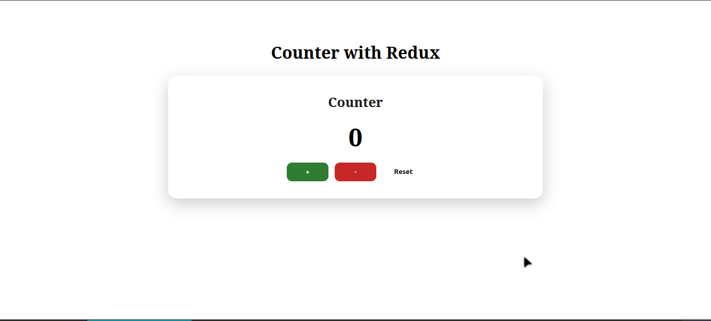
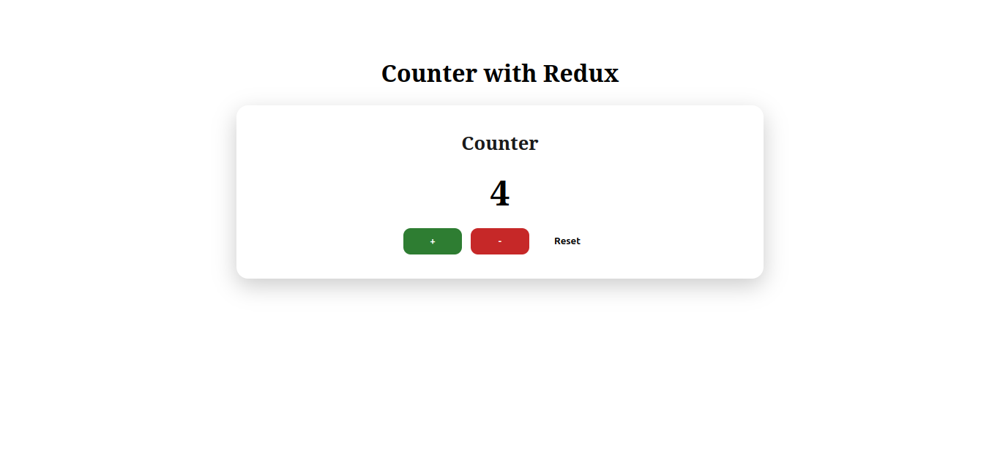
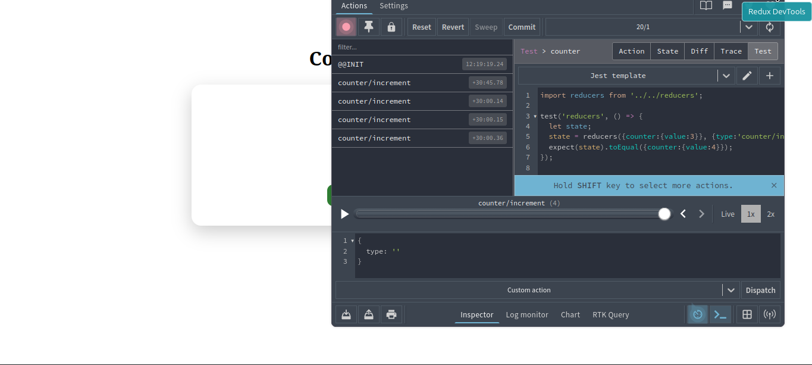

# Redux Counter Application

A simple counter application built with React and Redux Toolkit to demonstrate state management concepts.

## 📋 Overview

This project showcases:
- **Redux Toolkit** for centralized state management
- **React-Redux** hooks (`useSelector`, `useDispatch`)
- **Redux DevTools** integration for debugging
- Clean UI with styled components

## 🚀 Features

- ➕ Increment counter
- ➖ Decrement counter
- 🔄 Reset to initial state
- 🎨 Modern, responsive UI

## 📸 Screenshots

### Initial State


### Counter Incremented


### Redux DevTools


## 🛠️ Tech Stack

- **React** - UI library
- **Vite** - Build tool
- **Redux Toolkit** - State management
- **React-Redux** - React bindings for Redux

## 📂 Project Structure

```
src/
├── App.jsx           # Main app component
├── Counter.jsx       # Counter UI component
├── counterSlice.jsx  # Redux slice with actions & reducer
├── store.jsx         # Redux store configuration
├── main.jsx          # App entry point with Provider
├── App.css           # Component styles
└── index.css         # Global styles
```

## 🎯 Key Concepts

### Redux Slice (`counterSlice.jsx`)
Defines state shape and reducer logic using `createSlice`:
- **State**: `{ value: 0 }`
- **Actions**: `increment`, `decrement`, `reset`

### Store Configuration (`store.jsx`)
Configures the Redux store with the counter reducer.

### React Integration (`Counter.jsx`)
- `useSelector` - Access Redux state
- `useDispatch` - Dispatch actions to update state

## 🏃 Getting Started

### Installation
```bash
npm install
```

### Development
```bash
npm run dev
```

### Build
```bash
npm run build
```

## 📦 Dependencies

```json
{
  "@reduxjs/toolkit": "^2.x",
  "react-redux": "^9.x",
  "react": "^18.x",
  "react-dom": "^18.x"
}
```

## 🧪 Testing Redux DevTools

1. Install [Redux DevTools Extension](https://github.com/reduxjs/redux-devtools)
2. Open browser DevTools
3. Navigate to Redux tab
4. Interact with the counter to see state changes

