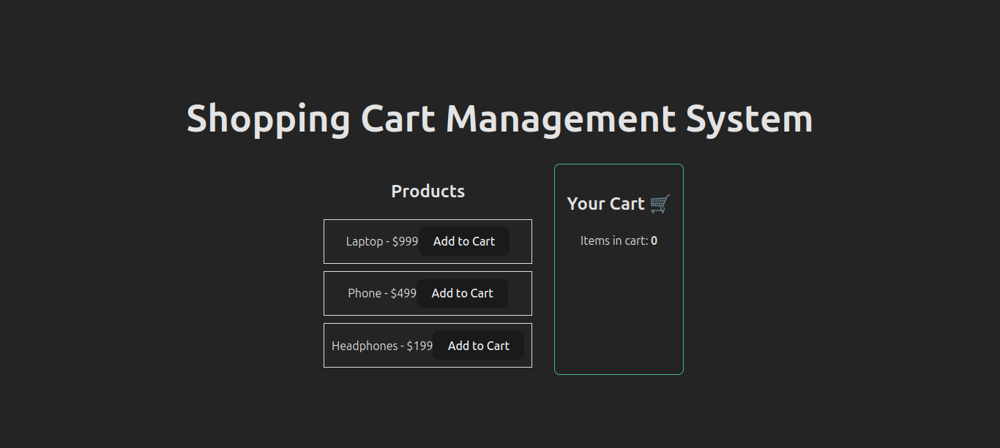
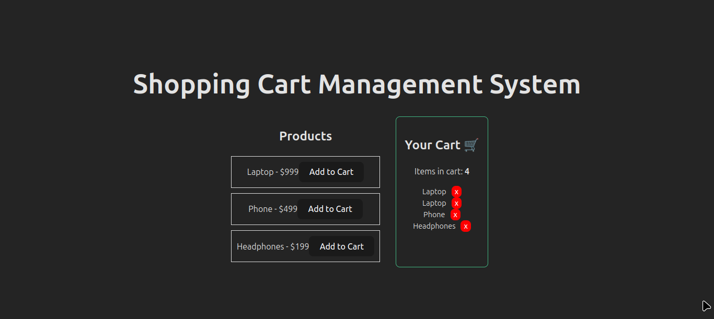
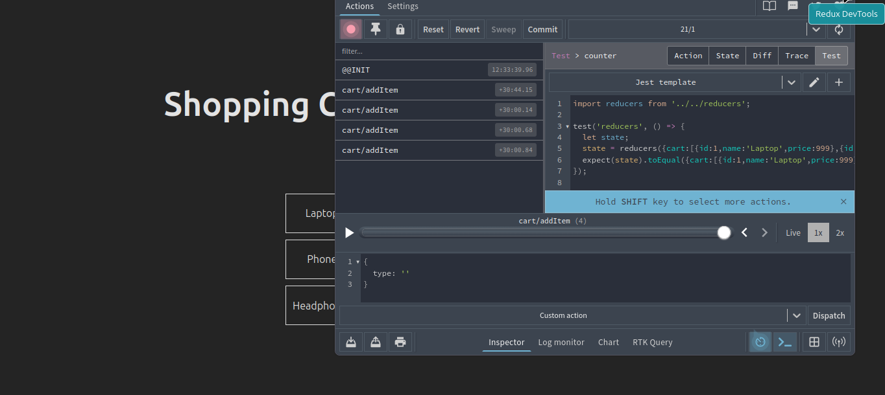

# Experiment 3: Shopping Cart Management System with Redux

A React application demonstrating global state management using Redux Toolkit for a shopping cart system.

## 🎯 Objective

Build a shopping cart application that uses Redux for centralized state management, allowing users to add and remove products from their cart while maintaining state across components.

## 🛠️ Technologies Used

- **React 18** - UI library
- **Redux Toolkit** - State management
- **Vite** - Build tool and dev server
- **Redux DevTools** - State debugging and visualization

## 📋 Features

- ✅ Display list of products with prices
- ✅ Add products to cart with Redux actions
- ✅ Remove items from cart
- ✅ Real-time cart count display
- ✅ Redux DevTools integration for state inspection
- ✅ Centralized state management

## 🏗️ Project Structure

```
exp-3/
├── src/
│   ├── App.jsx              # Main application component
│   ├── ProductList.jsx      # Product listing and add to cart
│   ├── CartView.jsx         # Cart display and remove items
│   ├── store.jsx            # Redux store and cart slice
│   ├── main.jsx             # Entry point with Redux Provider
│   ├── App.css              # Application styles
│   └── index.css            # Global styles
├── public/
├── package.json
└── README.md
```

## 🔧 Installation & Setup

1. **Clone the repository** (or navigate to project directory)
   ```bash
   cd exp-3
   ```

2. **Install dependencies**
   ```bash
   npm install
   ```

3. **Start development server**
   ```bash
   npm run dev
   ```

4. **Open browser**
   - Navigate to `http://localhost:5173`
   - Open Redux DevTools (F12 → Redux tab)

## 📦 Dependencies

```json
{
  "react": "^18.3.1",
  "react-dom": "^18.3.1",
  "react-redux": "^9.1.2",
  "@reduxjs/toolkit": "^2.2.7"
}
```

## 🎨 Redux Implementation

### Store Configuration (`store.jsx`)
```javascript
import { configureStore, createSlice } from '@reduxjs/toolkit';

const cartSlice = createSlice({
  name: 'cart',
  initialState: [],
  reducers: {
    addItem: (state, action) => { state.push(action.payload) },
    removeItem: (state, action) => state.filter(item => item.id !== action.payload)
  }
});

export const { addItem, removeItem } = cartSlice.actions;
export const store = configureStore({ reducer: { cart: cartSlice.reducer } });
```

### Redux Actions
- **`addItem(product)`** - Adds a product to the cart
- **`removeItem(productId)`** - Removes a product from the cart by ID

## 📸 Screenshots

### Initial State

*Empty cart with product listing*

### Added Items to Cart

*Products added to cart with real-time count*

### Redux DevTools

*State inspection using Redux DevTools Extension*

## 🔍 How It Works

1. **Redux Store Setup**
   - Store configured in `store.jsx` with cart slice
   - Provider wraps app in `main.jsx`

2. **Adding Products**
   - User clicks "Add to Cart" button
   - `dispatch(addItem(product))` called
   - Redux updates global state
   - CartView re-renders automatically

3. **Removing Products**
   - User clicks "x" button in cart
   - `dispatch(removeItem(id))` called
   - Item filtered from state
   - UI updates instantly

4. **State Inspection**
   - Open Redux DevTools in browser
   - View all dispatched actions
   - Inspect state changes
   - Time-travel debugging available

## 🎓 Learning Outcomes

- ✅ Understanding Redux Toolkit basics
- ✅ Creating slices and reducers
- ✅ Dispatching actions from components
- ✅ Using `useSelector` and `useDispatch` hooks
- ✅ Configuring Redux DevTools
- ✅ Managing global application state

## 🚀 Build for Production

```bash
npm run build
```

Output will be in the `dist/` directory.

## 🐛 Debugging

- **Redux DevTools not showing?**
  - Install [Redux DevTools Extension](https://github.com/reduxjs/redux-devtools)
  - Ensure Provider wraps App component
  
- **State not updating?**
  - Check if actions are properly dispatched
  - Verify reducer logic in store.jsx

## 📝 Future Enhancements

- [ ] Add quantity management
- [ ] Calculate total price
- [ ] Persist cart in localStorage
- [ ] Add product search/filter
- [ ] Implement checkout functionality

## 👨‍💻 Author

**Experiment 3 - Full Stack Development II**  
College Project - Redux State Management

---

## 📚 References

- [Redux Toolkit Documentation](https://redux-toolkit.js.org/)
- [React Redux Hooks](https://react-redux.js.org/api/hooks)
- [Redux DevTools](https://github.com/reduxjs/redux-devtools)
